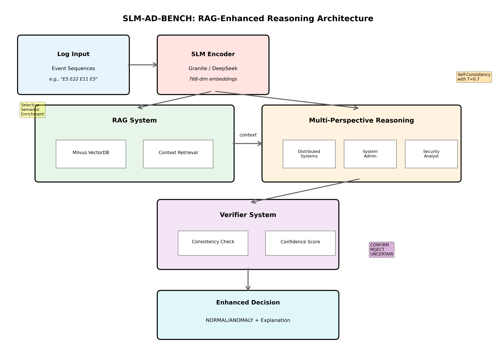

# SLM-AD-BENCH

## Overview

The SLM-AD-BENCH codebase is designed for production use with:

- **Modular architecture** with clear separation of concerns and extensibility in mind
- **Multiple inference backends** (Local Transformers, vLLM (tbd))
- **Reduced code duplication** through abstraction and inheritance
- **Comprehensive testing** with unit and integration tests
- **Configuration management** with YAML-based settings
- **Better error handling** and logging
- **Async/await support** for better performance

  

## Getting Started

See `examples/` directory for usage examples and migration patterns.
Benchmark scripts (test, small, large) are also provided.  
